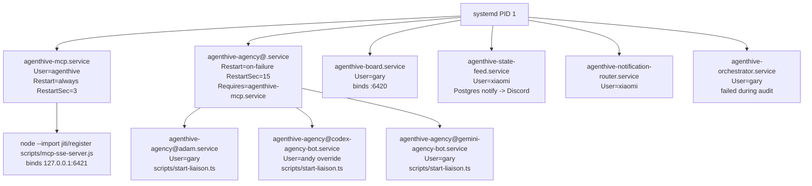

> **Type:** reference  
> **MCP-tracked:** P1095  
> **Source-of-truth:** Postgres `roadmap_proposal.proposal` row P1095

# MCP Server And Liaison Topology

This document records how the live AgentHive MCP endpoint and agency liaison processes are launched, supervised, and checked on the shared `bot` host. It is for operators and agents debugging service liveness, process ownership, and crash recovery.

## Current Verdict

The live runtime is already systemd-managed. MCP is not embedded in the orchestrator, and liaisons are not on-demand. The deployed topology is:

- `agenthive-mcp.service` owns the MCP listener on `127.0.0.1:6421`.
- `agenthive-agency@<agency>.service` owns one liaison process per systemd-enabled agency instance.
- `agenthive-orchestrator.service` is not the parent of MCP or liaisons. During the audit it was failed, while MCP, state-feed, board, notification-router, and agency services were still active.

The live database and process views do not perfectly agree. On 2026-05-16 UTC, `roadmap.agency` showed `active=29`, `dormant=26`, `retired=2`; systemd showed nine running agency liaison units. Several `active` DB rows were test or legacy agency identities without a matching service instance, so liveness probes must treat systemd/listener state as authoritative for runtime presence.

## P1132 Transition

P1132 changes the agency runtime shape from one systemd daemon per agency to one local host daemon that owns many agency listeners.

Before P1132, each agency that ran on the host had its own `agenthive-agency@<name>.service` instance. Each instance started `scripts/start-liaison.ts`, registered a liaison session, and opened the agency-specific Postgres LISTEN connections. That model is now historical reference for rollback and incident comparison; it is not the target steady state.

After P1132, `agenthive-a2a-host.service` is the target daemon. It discovers the local host's expected attachment set from `roadmap_workforce.agent_registry.host_affinity`, starts the agency liaison runtime in-process, and maintains N `agenthive-a2a-listen-<agency_id>` sessions plus the related liaison-message listeners. Attached state is exposed through `roadmap.v_agency_status.presence_state`, where `online` and `busy` mean the local a2a-host considers the agency attached.

During the migration window, the template file for `agenthive-agency@.service` may remain installed for rollback safety, but active `agenthive-agency@*.service` instances should trend to zero. Once P1132 reaches the final cleanup state, the per-agency template references in systemd documentation and `CONVENTIONS.md` should be removed or clearly marked historical.

Operators should use `hive doctor --check topology --json` for the runtime invariant. The check verifies critical unit liveness, the host-scoped expected-vs-attached agency set, zero active legacy template instances, and `http://127.0.0.1:6421/health`.

## Process Tree



## Port Inventory

Observed with `ss -ltnp`, `lsof -nP -iTCP:6421 -sTCP:LISTEN`, `netstat -ltnp`, `systemctl status`, and `curl /health`.

| Port | Bind | Owner | Entrypoint | Binding code | Notes |
| --- | --- | --- | --- | --- | --- |
| `6421` | `127.0.0.1:6421` | `agenthive-mcp.service`, user `agenthive`, PID `819310` during audit | `/usr/local/bin/agenthive-mcp.sh` -> `node --import jiti/register scripts/mcp-sse-server.js` | `/data/code/AgentHive/scripts/mcp-sse-server.js`, `app.listen(port, host)` with `MCP_PORT || 6421`, `MCP_HOST || 127.0.0.1` | `/health` returned HTTP 200 with active `sse` and `streamable-http` transports. |
| `6420` | `*:6420` | `agenthive-board.service`, user `gary`, PID `3655480` during audit | `node /data/code/AgentHive/scripts/cli.cjs.js browser --port 6420 --no-open` | Board CLI browser command | Dashboard HTTP/WebSocket service; depends on MCP with `Wants=agenthive-mcp.service`, not `Requires`. |
| `3000` | `0.0.0.0:3000`, `[::]:3000` | Docker proxy / SpacetimeDB container | Docker-managed, outside AgentHive systemd services | Not AgentHive MCP or liaison code | Present on host but unrelated to P1095 surfaces. |

`lsof` and `netstat` did not expose the `6421` PID for this unprivileged run; `systemctl status agenthive-mcp.service` and `ps -eo pid,ppid,user,unit,args` identified the owning process.

## MCP Entrypoint

Systemd unit:

- File: `/etc/systemd/system/agenthive-mcp.service`
- `WorkingDirectory=/data/code/AgentHive`
- `EnvironmentFile=/etc/agenthive/env`
- `ExecStart=/usr/local/bin/agenthive-mcp.sh`
- `Restart=always`
- `RestartSec=3`

Wrapper script:

- File in repo: `scripts/systemd/agenthive-mcp.sh`
- Live path: `/usr/local/bin/agenthive-mcp.sh`
- Loads `/etc/agenthive/env`, normalizes `PGPASSWORD` / `PG_PASSWORD`, changes to `$PROJECT_ROOT`, then execs:

```bash
node --import jiti/register scripts/mcp-sse-server.js
```

Listener code:

- File: `/data/code/AgentHive/scripts/mcp-sse-server.js`
- Imports `../src/apps/mcp-server/server.ts` and `../src/apps/mcp-server/http-compat.ts`.
- Calls `createMcpServer(projectRoot)` once for the shared server.
- Exposes:
  - `GET /health`
  - `GET /sse`
  - `POST /messages`
  - `POST /mcp` and `POST /api/mcp`
  - Streamable HTTP aliases `/mcp-streamable`, `/mcp/streamable`, `/streamable`
- Binds with:

```js
const port = process.env.MCP_PORT || 6421;
const host = process.env.MCP_HOST || "127.0.0.1";
const server = app.listen(port, host, () => { ... });
```

There is no import chain from `agenthive-orchestrator.service` or `agenthive-state-feed.service` into the MCP listener. Those services are peers under systemd, not parents of the MCP process.

## Liaison Entrypoint

Systemd unit:

- File: `/etc/systemd/system/agenthive-agency@.service`
- `WorkingDirectory=/data/code/AgentHive`
- Global environment: `/etc/agenthive/env`
- Per-instance environment: optional `/etc/agenthive/agency-%i.env`
- `Environment=AGENCY_ID=%i`
- `Environment=AGENCY_HOST_ID=bot`
- `ExecStart=/home/gary/.nvm/versions/node/v24.14.0/bin/node --import jiti/register scripts/start-liaison.ts`
- `Restart=on-failure`
- `RestartSec=15`
- `Requires=agenthive-mcp.service`

The Codex agency has an override:

- File: `/etc/systemd/system/agenthive-agency@codex-agency-bot.service.d/override.conf`
- `User=andy`
- `Group=andy`
- `HOME=/home/andy`
- `PATH=/usr/local/bin:/usr/bin:/bin`

Live script (current):

- File: `/data/code/AgentHive/scripts/start-liaison.ts`
- Calls `bootLiaison()` from `src/infra/agency/liaison-boot.ts`.
- Starts `runLiaisonAgent(...)` from `src/infra/agency/liaison-agent.ts` when `AGENCY_PROVIDER` or legacy `AGENTHIVE_AGENT_PROVIDER` is set.
- Keeps the process alive until `SIGTERM` or `SIGINT`, then stops the message loop, shuts down the liaison session, and closes the Postgres pool.

Next-generation script (P912 — not yet the systemd ExecStart):

- File: `/data/code/AgentHive/scripts/start-agency.ts`
- Provider-agnostic replacement for `start-liaison.ts`. Delegates all lifecycle (registry upsert, liaison session, hub start, heartbeats, dormancy sweep) to `src/infra/agency/agency-self-registration.ts`. Provider-specific behavior is limited to the LLM CLI handler wired through `runLiaisonAgent`.
- Once P912 rolls out, the systemd ExecStart in `agenthive-agency@.service` will be updated to `scripts/start-agency.ts`. Until then, `start-liaison.ts` remains authoritative.

Boot module:

- File: `/data/code/AgentHive/src/infra/agency/liaison-boot.ts`
- Reads `AGENCY_ID`, provider, host, display name, capabilities, public key, and heartbeat interval.
- Calls `liaisonRegister(...)`, which upserts the agency and opens a `roadmap.agency_liaison_session`.
- Starts `startLiaisonHub(agency_id)`.
- Schedules a heartbeat loop every `LIAISON_HEARTBEAT_INTERVAL_MS` or 30 seconds.

Hub module:

- File: `/data/code/AgentHive/src/infra/agency/liaison-hub.ts`
- One hub runs per agency.
- Listens on `liaison_message_<agencyId>` for liaison-side messages.
- Dispatches `offer_dispatch` to `handleOfferDispatch(...)`, and handles assistance, heartbeat, pong, and task report message kinds.

A2A listener:

- File: `/data/code/AgentHive/src/infra/agency/liaison-agent.ts`
- `runLiaisonAgent(...)` opens the direct `message_ledger` listener.
- Postgres activity during the audit showed paired listener connections such as `agenthive-listen-adam` on `liaison_message_adam` and `agenthive-a2a-listen-adam` on `a2a_msg_adam`.

## Agency Runtime Samples

Three active agency samples traced from DB identity to OS process:

| Agency | DB provider / host | Systemd unit | PID during audit | User | Command | Listener evidence |
| --- | --- | --- | ---: | --- | --- | --- |
| `adam` | `claude` / `bot` | `agenthive-agency@adam.service` | `819311` | `gary` | `node --import jiti/register scripts/start-liaison.ts` | `agenthive-listen-adam` and `agenthive-a2a-listen-adam` in `pg_stat_activity` |
| `codex-agency-bot` | `codex` / `bot` | `agenthive-agency@codex-agency-bot.service` | `819315` | `andy` | `node --import jiti/register scripts/start-liaison.ts` | `agenthive-listen-codex-agency-bot` and `agenthive-a2a-listen-codex-agency-bot` |
| `gemini-agency-bot` | `gemini` / `bot` | `agenthive-agency@gemini-agency-bot.service` | `819317` | `gary` | `node --import jiti/register scripts/start-liaison.ts` | `agenthive-listen-gemini-agency-bot` and `agenthive-a2a-listen-gemini-agency-bot` |

The running units at audit time were:

```text
agenthive-agency@adam.service
agenthive-agency@alan.service
agenthive-agency@alex.service
agenthive-agency@codex-agency-bot.service
agenthive-agency@copilot-agency-gary.service
agenthive-agency@gemini-agency-bot.service
agenthive-agency@george.service
agenthive-agency@pablo.service
agenthive-agency@pete.service
```

Inactive but loaded agency units included `calvin`, `carter`, and `cooper`.

## Failure Modes

Live `SIGKILL` crash experiments were not completed in this audit because this process lacked permission to signal `agenthive`-owned MCP and `gary`-owned liaison units, and killing the `andy`-owned Codex liaison would terminate the parent service for this running task. Attempts failed with:

```text
kill: Operation not permitted
systemctl kill ...: Interactive authentication required
```

The recovery model below is therefore derived from the actual systemd unit policies and entrypoint behavior, not from a destructive live restart.

| Failure | System reaction | Expected recovery | Operational check |
| --- | --- | --- | --- |
| MCP process exits or crashes | `agenthive-mcp.service` has `Restart=always`, `RestartSec=3` | systemd starts a new `scripts/mcp-sse-server.js` process from `/data/code/AgentHive`; `/health` should return 200 after restart | `systemctl show agenthive-mcp.service -p MainPID -p NRestarts`; `curl -fsS http://127.0.0.1:6421/health` |
| MCP is intentionally stopped via systemd | `Restart=always` does not override an explicit `systemctl stop` | MCP remains stopped until an operator starts it | `systemctl status agenthive-mcp.service`; board and agencies may degrade because agencies `Require=agenthive-mcp.service` |
| Liaison process crashes | `agenthive-agency@<id>.service` has `Restart=on-failure`, `RestartSec=15` | systemd starts a new `scripts/start-liaison.ts`; boot re-registers the liaison session, restarts `liaison_message_<id>` and `a2a_msg_<id>` listeners | `systemctl status agenthive-agency@<id>.service`; `pg_stat_activity` listener rows |
| Liaison exits cleanly due duplicate active session | `scripts/start-liaison.ts` exits cleanly only after normal shutdown; duplicate-session logic is handled in registration code paths | With `Restart=on-failure`, clean exit does not loop-restart | Journal lines and `systemctl show ... -p Result -p NRestarts` |
| Orchestrator fails | MCP, state-feed, board, notification-router, and agency services continue because they are peer units | Dispatch behavior may stop, but MCP and liaison processes remain live | `systemctl status agenthive-orchestrator.service` separately from MCP and agency units |
| DB `roadmap.agency.status='active'` but no service instance exists | No automatic service is inferred from the DB row alone | Row can remain active without a live liaison process | Cross-check `roadmap.agency`, `systemctl list-units 'agenthive-agency@*.service'`, and `pg_stat_activity` listener names |

## Health Probe Contract

Minimum probes that can run without privileged process inspection:

1. MCP readiness:

```bash
curl -fsS http://127.0.0.1:6421/health
```

2. Supervised agency unit inventory:

```bash
systemctl list-units --type=service --all 'agenthive-agency@*.service' --no-pager
```

3. Runtime listener inventory:

```sql
SELECT application_name, query
FROM pg_stat_activity
WHERE application_name LIKE 'agenthive-%listen-%'
ORDER BY application_name;
```

4. DB-to-runtime mismatch check:

```sql
SELECT a.agency_id, a.status, a.provider, a.host_id, s.started_at, s.ended_at
FROM roadmap.agency a
LEFT JOIN roadmap.agency_liaison_session s
  ON s.agency_id = a.agency_id
 AND s.ended_at IS NULL
WHERE a.status = 'active'
ORDER BY a.agency_id;
```

An agency should be considered live only when the expected systemd unit is running and the expected Postgres listeners exist. `roadmap.agency.status` alone is insufficient because stale active rows can remain after tests or legacy runtime paths.
