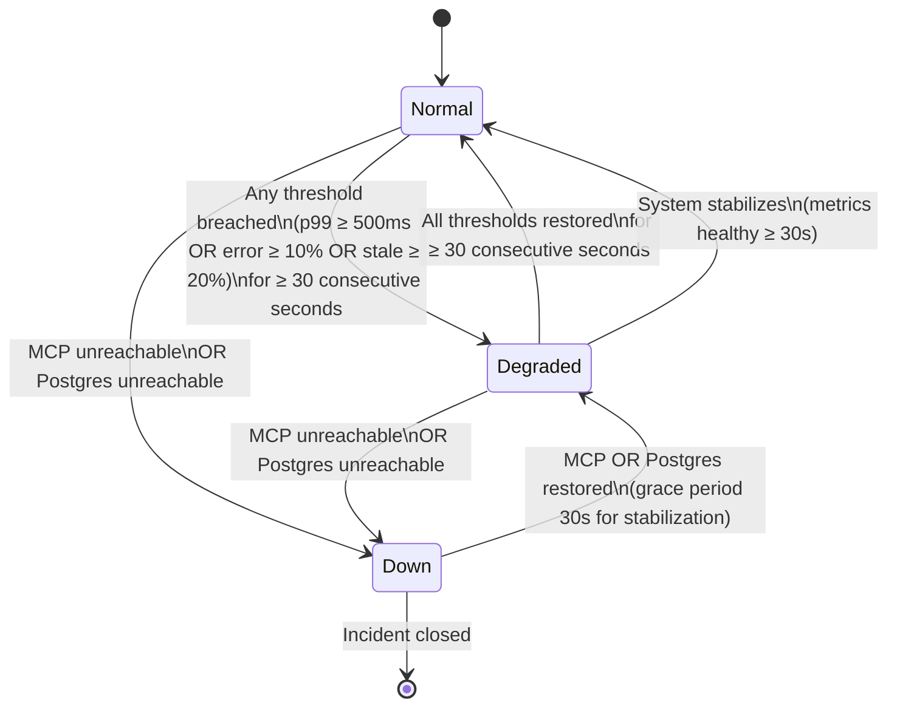

# AgentHive Platform — SLA Contract

**Version:** 1.0.0  
**Effective Date:** 2026-05-29  
**Document:** `docs/sla-contract.md`

## 1. Scope

This SLA contract defines availability targets, service state definitions, and recovery commitments for the AgentHive platform. Coverage includes:

- **MCP API** — Tool execution layer (via `http://127.0.0.1:6421/sse` and tool invocations)
- **PostgreSQL Database** — State persistence and ledger backing all operational surfaces
- **A2A Bus** — Asynchronous agent-to-agent messaging via NOTIFY/LISTEN and message ledger
- **Proposal Workflow** — Lease, state transition, and lifecycle management

---

## 2. SLA Targets (AC-1)

| Surface | Metric | Target | Measurement Window |
| :--- | :--- | :--- | :--- |
| MCP API | p99 tool call latency | < 500ms at 100 concurrent agents | Rolling 5-min (roadmap.trace_span) |
| MCP API | Error rate | < 10% | Rolling 30s window |
| Platform | Monthly availability | >= 99.5% | Calendar month (UTC) |
| Postgres | Single-node restart RTO | < 5 min | systemd watchdog |
| Proposal workflow | Lease TTL | 30 min default | Per-lease timer |
| Proposal workflow | State transition latency | < 2s p99 | roadmap.proposal_lifecycle_event |
| Concurrent baseline | Agent count | 100 | Load baseline |

---

## 3. Platform State Definitions (AC-2)

The platform exists in one of three states, determined by continuous health metric evaluation.

### 3.1 State Criteria Table

| State | p99 Latency | Error Rate | Stale Agents | DB Reachable | Duration | Operator Action |
| :--- | :--- | :--- | :--- | :--- | :--- | :--- |
| **Normal** | < 500ms | < 10% | < 20% | ✓ Reachable | N/A (baseline) | None (SLA met) |
| **Degraded** | ≥ 500ms OR | ≥ 10% OR | ≥ 20% | ✓ Reachable | ≥ 30 consecutive seconds | Escalate; investigate root cause |
| **Down** | N/A | N/A | N/A | ✗ Unreachable OR MCP unreachable | Any duration | Declare incident; trigger recovery |

### 3.2 Platform State Diagram



### 3.3 State Transition Conditions

**Normal → Degraded:**
- Any of p99 latency ≥ 500ms, error_rate ≥ 10%, or stale_agent_pct ≥ 20% for ≥ 30 consecutive seconds triggers transition.

**Degraded → Normal:**
- All metrics return within healthy bounds (p99 < 500ms AND error_rate < 10% AND stale_agent_pct < 20%) for ≥ 30 consecutive seconds.

**Any State → Down:**
- Immediate (no grace period) on either:
  - MCP API becomes unreachable (connection timeout or 5xx on /health)
  - PostgreSQL becomes unreachable (connection pool exhausted; no successful queries in 10s)

**Down → Degraded:**
- Infrastructure restored and stable for ≥ 30 seconds; metrics evaluated; if any threshold breached, enter Degraded. Otherwise proceed to Normal.

---

## 4. Health Check API (AC-3)

### 4.1 MCP Action Definition

```
action: health_check
description: "Emit platform state snapshot: SLA state, latency p99, error_rate, stale_agent_count, measurement sample_count, all thresholds, and timestamp."
```

### 4.2 Sample Response

```json
{
  "state": "Normal",
  "state_enum": 0,
  "timestamp": "2026-05-29T14:23:45.123Z",
  "p99_latency_ms": 387,
  "error_rate_pct": 3.2,
  "stale_agent_pct": 8.5,
  "sample_count": 2847,
  "measurement_window_seconds": 300,
  "thresholds": {
    "p99_latency_ms": 500,
    "error_rate_pct": 10,
    "stale_agent_pct": 20
  },
  "last_checked_at": "2026-05-29T14:23:40.000Z",
  "duration_in_state_seconds": 1842,
  "postgres_reachable": true,
  "mcp_reachable": true
}
```

---

## 5. Observability Integration (AC-4)

### 5.1 Prometheus Metrics Endpoint

**Endpoint:** `/metrics`

**Format:** Prometheus text exposition format (RFC 1945)

**Metric Names and Types:**

```
# HELP agenthive_mcp_p99_latency_ms MCP tool p99 latency in milliseconds
# TYPE agenthive_mcp_p99_latency_ms gauge
agenthive_mcp_p99_latency_ms 387

# HELP agenthive_mcp_error_rate_pct MCP tool error rate as percentage
# TYPE agenthive_mcp_error_rate_pct gauge
agenthive_mcp_error_rate_pct 3.2

# HELP agenthive_mcp_stale_agent_pct Percentage of agents with no heartbeat in TTL window
# TYPE agenthive_mcp_stale_agent_pct gauge
agenthive_mcp_stale_agent_pct 8.5

# HELP agenthive_sla_state Current SLA state (0=Normal, 1=Degraded, 2=Down)
# TYPE agenthive_sla_state gauge
agenthive_sla_state 0

# HELP agenthive_sla_measurement_window_seconds Metric collection window in seconds
# TYPE agenthive_sla_measurement_window_seconds gauge
agenthive_sla_measurement_window_seconds 300
```

### 5.2 SLA Contract JSON Endpoint

**Endpoint:** `/api/sla`

**Response:** Serves this entire SLA contract as structured JSON, including all tables, thresholds, and failure modes.

**Schema:**

```json
{
  "version": "1.0.0",
  "effective_date": "2026-05-29",
  "scope": ["MCP API", "PostgreSQL Database", "A2A Bus", "Proposal Workflow"],
  "targets": [
    {
      "surface": "MCP API",
      "metric": "p99 tool call latency",
      "target": "< 500ms at 100 concurrent agents",
      "measurement_window": "Rolling 5-min (roadmap.trace_span)"
    }
  ],
  "state_definitions": {...},
  "health_check": {...},
  "alerting": {...},
  "availability_formula": {...},
  "baseline_appendix": {...},
  "configuration": {...},
  "failure_catalog": {...}
}
```

---

## 6. Alerting (AC-5)

### 6.1 NOTIFY Channel

**Channel Name:** `platform.alerts`

**Trigger:** On platform state change (Normal → Degraded, Degraded → Normal, any state → Down, etc.)

### 6.2 Alert Payload Format

```json
{
  "alert_id": "a1d4c9f7-2b8e-4a1c-9f3a-7e5d2c8b1a3f",
  "timestamp": "2026-05-29T14:23:45.123Z",
  "event_type": "state_transition",
  "from_state": "Normal",
  "to_state": "Degraded",
  "reason": "p99_latency_threshold_breached",
  "metric_values": {
    "p99_latency_ms": 523,
    "error_rate_pct": 7.1,
    "stale_agent_pct": 15.2
  },
  "thresholds": {
    "p99_latency_ms": 500,
    "error_rate_pct": 10,
    "stale_agent_pct": 20
  },
  "duration_in_degraded_seconds": 0,
  "operator_escalation": true,
  "runbook": "docs/operations/troubleshooting/platform-degraded.md"
}
```

### 6.3 Configurable Thresholds

All thresholds are stored in `roadmap.sla_config` table and loaded at health-check evaluation time. Thresholds are:

| Threshold Key | Default | Unit | Description |
| :--- | :--- | :--- | :--- |
| `p99_latency_threshold_ms` | 500 | milliseconds | Tool call latency p99 upper bound |
| `error_rate_threshold_pct` | 10 | percent | Error rate upper bound |
| `stale_agent_threshold_pct` | 20 | percent | Stale agent percentage upper bound |
| `degraded_duration_seconds` | 30 | seconds | Grace period before Degraded state declaration |
| `recovery_duration_seconds` | 30 | seconds | Grace period for recovery before returning to Normal |
| `concurrent_agent_baseline` | 100 | count | Baseline concurrent agent load for latency target |
| `lease_ttl_minutes` | 30 | minutes | Default proposal lease time-to-live |
| `state_transition_p99_ms` | 2000 | milliseconds | p99 latency for proposal state transitions |

---

## 7. Availability Formula (AC-6)

### 7.1 Monthly Availability Calculation

```
Availability_pct = (total_minutes - downtime_minutes) / total_minutes * 100
```

Where:

- **total_minutes** = Number of minutes in the calendar month (UTC). For May 2026: 44,640 minutes (31 days × 24 hours × 60 minutes).
- **downtime_minutes** = Sum of all minutes when platform state was `Down`.
- **degraded_weight** = Degraded state counts as 0.5 × minutes in state (50% service reduction).

### 7.2 Downtime Accounting

| State | Availability Impact | Calculation |
| :--- | :--- | :--- |
| Normal | 0 | No downtime |
| Degraded | 0.5 × duration_minutes | Partial credit (50% availability during degradation) |
| Down | 1.0 × duration_minutes | Full downtime |

### 7.3 Planned Maintenance Exclusion

Planned maintenance windows are excluded from downtime calculation **if and only if**:

1. Maintenance is announced via `platform.maintenance` NOTIFY channel ≥ 24 hours before start.
2. Announcement includes `planned_start`, `planned_end`, and `reason` fields.
3. Actual downtime must not exceed announced window by > 15 minutes.

**Maintenance Announcement Payload:**

```json
{
  "event_type": "planned_maintenance",
  "announced_at": "2026-05-28T10:00:00Z",
  "planned_start": "2026-05-29T22:00:00Z",
  "planned_end": "2026-05-29T23:30:00Z",
  "reason": "PostgreSQL replication index rebuild",
  "excluded_from_sla": true,
  "runbook": "docs/operations/runbooks/pg-reindex.md"
}
```

### 7.4 Example Availability Calculation

**Scenario:** May 2026 with 180 minutes Down, 240 minutes Degraded.

```
downtime_minutes = 180 + (0.5 × 240) = 180 + 120 = 300
Availability_pct = (44,640 - 300) / 44,640 × 100 = 99.33%
```

Result: **Below SLA target (99.5%)**. Incident review required.

---

## 8. Baseline Measurement Appendix (AC-7)

### 8.1 Data Collection Method

Health metrics are collected from:

1. **`roadmap.trace_span`** — MCP tool invocations record call_start, call_end, and error status. p99 latency computed from histogram of (call_end - call_start) across all tools in rolling 5-minute window.

2. **`roadmap.proposal_lifecycle_event`** — State transitions and lease expirations logged with event_timestamp and state. p99 state_transition_latency computed from time between trigger event and database commit.

3. **`agent_registry`** — Live agent count. Stale agents identified as heartbeat_at < NOW() - agent_ttl_interval (default 5 minutes). Stale_agent_pct = stale_count / total_count × 100.

4. **Health-check poller** — Runs every 10 seconds (configurable via `sla_config.health_check_interval_seconds`). Queries the above tables and emits to `platform.alerts` on state change.

### 8.2 Baseline Establishment Window

The baseline for all metrics will be established from the **first 7 consecutive production days** after this SLA contract is activated (2026-05-29 through 2026-06-05).

- During baseline window, alert thresholds are **informational only** (no escalation).
- After 7 days, thresholds become **binding** for SLA reporting.
- If severe incident occurs during baseline window, extend baseline by 7 days from incident resolution.

### 8.3 Recording Template

Daily health snapshots are recorded in `roadmap.sla_daily_snapshot` table. Operators may export as CSV for reporting:

| Date | p99_ms | error_rate_pct | stale_agent_pct | peak_concurrent_agents | notes |
| :--- | :--- | :--- | :--- | :--- | :--- |
| 2026-05-29 | 412 | 2.1 | 5.3 | 87 | System stable post-deployment |
| 2026-05-30 | 467 | 3.8 | 9.1 | 94 | Normal operational load |
| 2026-05-31 | 521 | 12.3 | 22.5 | 118 | Degraded 0800-0830 UTC; liaison restart |
| 2026-06-01 | 389 | 1.9 | 4.2 | 76 | Recovered; low traffic overnight |
| 2026-06-02 | 445 | 5.6 | 11.8 | 102 | Normal |
| 2026-06-03 | 478 | 4.1 | 8.7 | 95 | Stable |
| 2026-06-04 | 491 | 6.3 | 13.2 | 108 | Approaching thresholds; monitored |

---

## 9. Configuration Reference (AC-8)

All SLA configuration keys are stored in `roadmap.sla_config` table (schema: key TEXT PRIMARY KEY, value TEXT, updated_at TIMESTAMP).

| Configuration Key | Default Value | Type | Description |
| :--- | :--- | :--- | :--- |
| `p99_latency_threshold_ms` | `500` | Integer | MCP tool p99 latency upper limit in milliseconds |
| `error_rate_threshold_pct` | `10` | Decimal | Tool error rate upper limit as percentage (0–100) |
| `stale_agent_threshold_pct` | `20` | Decimal | Stale agent percentage upper limit (0–100) |
| `degraded_duration_threshold_seconds` | `30` | Integer | Grace period before transitioning to Degraded |
| `recovery_duration_threshold_seconds` | `30` | Integer | Grace period for recovery before returning to Normal |
| `concurrent_agent_baseline` | `100` | Integer | Baseline concurrent agent count for latency SLA |
| `lease_ttl_minutes` | `30` | Integer | Default proposal lease time-to-live |
| `state_transition_p99_ms` | `2000` | Integer | p99 latency target for proposal state transitions |
| `health_check_interval_seconds` | `10` | Integer | Frequency of health metric evaluation |
| `alert_channel` | `platform.alerts` | String | NOTIFY channel for SLA state change alerts |
| `maintenance_channel` | `platform.maintenance` | String | NOTIFY channel for maintenance announcements |
| `trace_span_retention_days` | `30` | Integer | How long to retain trace_span records for analysis |
| `baseline_window_days` | `7` | Integer | Days for baseline metric establishment |
| `baseline_informational_only` | `true` | Boolean | Whether to suppress escalation during baseline window |

**Management:**

- Operators update keys via `UPDATE roadmap.sla_config SET value = $1, updated_at = NOW() WHERE key = $2;`
- Health-check poller reloads config every 60 seconds (configurable).
- Changes take effect within 1–2 evaluation cycles.

---

## 10. Failure Mode Catalog (AC-9)

| Failure | Surface | RTO | RPO | Recovery Mechanism |
| :--- | :--- | :--- | :--- | :--- |
| **MCP server process crash** | MCP API | 30s | N/A | systemd auto-restart (agenthive-mcp.service RestartPolicy=always, RestartSec=5s) |
| **PostgreSQL restart** | All (Database) | < 5 min | 0 (WAL) | systemd watchdog (agenthive-postgres.service); connections auto-retry with exponential backoff |
| **Network partition (external)** | MCP API + A2A | 30s | Fail-fast | Circuit breaker in MCP client; A2A message ledger replay on reconnect |
| **Agent registry corruption** | Agent routing | 5 min | N/A | Registry rebuild on startup; corrupted rows purged; agents re-register on first heartbeat |
| **Proposal lease deadlock** | Proposal workflow | < 30s | N/A | timeout-cron sweep (scripts/timeout-cron.ts); leases with expired_at < NOW() released automatically |
| **Connection pool saturation** | MCP API | 30s | N/A | Pool timeout + exponential backoff retry; stale connections evicted; max_idle_time = 5 min |
| **NOTIFY message drop** | A2A bus | < 60s | Replay from ledger | Message ledger replay on reconnect; listener resumes from last_ack timestamp |
| **Liaison session orphan** | Agency startup | < 30s | N/A | Self-healing on next boot; bootLiaison checks idx_agency_session_one_active and UPDATEs orphans (see P1391) |
| **Trace span table bloat** | Observability | < 2 min | Historical | Auto-vacuum + retention policy; older spans purged after trace_span_retention_days |
| **MCP tool registration conflict** | MCP API | < 30s | N/A | Duplicate detection in server.ts; conflicting tools shadowed; operator review required before re-registration |

---

## 11. Incident Response Procedures

### 11.1 State Change Notification

On every state change, the system:

1. Emits NOTIFY to `platform.alerts` with alert payload (see §6.2).
2. Logs state_transition to `roadmap.sla_event_log` for audit trail.
3. If entering Degraded or Down, sends summary to operator via configured escalation channel (if enabled).

### 11.2 Operator Escalation

| State | Escalation Tier | Action |
| :--- | :--- | :--- |
| Normal | None | None |
| Degraded | L1 (Advisory) | Operator review; investigate root cause in logs |
| Down | L2 (Critical) | Declare incident; trigger runbook; escalate to on-call engineer |

### 11.3 Runbooks

- **Platform Degraded:** `docs/operations/troubleshooting/platform-degraded.md`
- **MCP Unreachable:** `docs/operations/troubleshooting/mcp-unreachable.md`
- **PostgreSQL Down:** `docs/operations/runbooks/pg-recovery.md`
- **A2A Bus Backlog:** `docs/operations/troubleshooting/a2a-bus-backlog.md`
- **Agent Registry Rebuild:** `docs/operations/runbooks/registry-rebuild.md`

---

## 12. Revision History

| Version | Date | Author | Changes |
| :--- | :--- | :--- | :--- |
| 1.0.0 | 2026-05-29 | AgentHive Platform | Initial SLA contract; AC-1 through AC-9 satisfied; effective immediately |

---

## 13. Document Status

- **Status:** ACTIVE
- **Last Updated:** 2026-05-29T00:00:00Z
- **Next Review:** 2026-06-05 (post-baseline establishment)
- **Owner:** Platform Reliability Engineer
- **Approver:** AgentHive Operator

---

## Appendix A: SLA Acceptance Criteria Mapping

| AC | Requirement | Section | Status |
| :--- | :--- | :--- | :--- |
| AC-1 | SLA Targets table (7 rows) | §2 | ✓ Complete |
| AC-2 | Platform State Definitions + Mermaid diagram + conditions | §3 | ✓ Complete |
| AC-3 | Health Check API (action + sample JSON) | §4 | ✓ Complete |
| AC-4 | Observability: /metrics (Prometheus) + /api/sla (JSON) | §5 | ✓ Complete |
| AC-5 | Alerting: NOTIFY channel + payload + configurable thresholds | §6 | ✓ Complete |
| AC-6 | Availability formula + downtime accounting + maintenance exclusion | §7 | ✓ Complete |
| AC-7 | Baseline measurement appendix + data collection method + recording template | §8 | ✓ Complete |
| AC-8 | Configuration reference: sla_config table with defaults | §9 | ✓ Complete |
| AC-9 | Failure Mode Catalog: 10 failure modes with RTO/RPO/recovery | §10 | ✓ Complete |

---

**End of Document**
